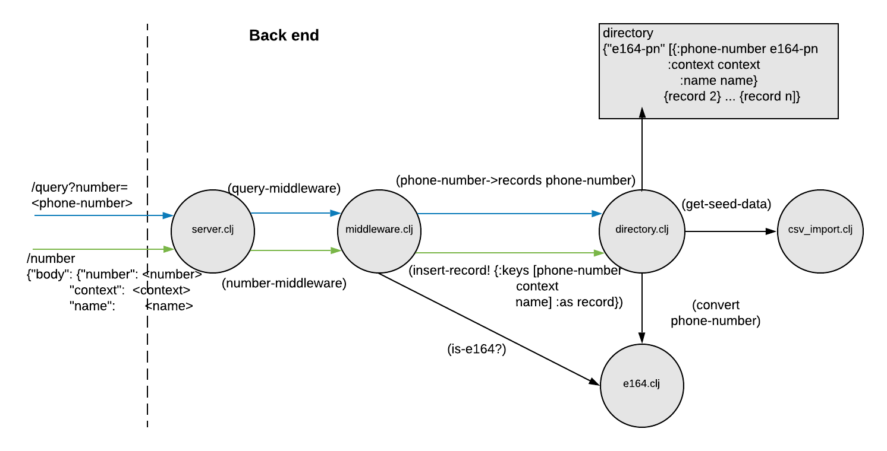

# Phone Directory  

### How to run  
Once the repository is cloned:
1. Move `interview-callerid-data.csv` to the `resources` directory.  
2. Set the port. In `resources/config.edn` you will see `{ :port 8080 }`. Change the port if you would like.  
3. In the project directory, run  
```
lein run
```

Here are sample curl commands:  
**GET Request:**
```
curl http://localhost:8080/query?number=%2B17193346351
```
**POST Request:**
```
curl -H 'Content-Type: application/json' -d '{"body": {"name": "YourName", "context": "YourContext", "number": "+12345678910"}}' -X POST http://localhost:8080/number
```
### Stack  
Originally, I had plans to build a small front end to make it easier to launch requests. Unfortunately, I didn't quite get there. For small front to back Clojure(Script) web apps, I have been using this Leiningen [template](https://github.com/gered/simple-web-app-template). This template, uses ring, compojure, and immutant on the back, and figwheel and reagent on the front.  

I used *Clojure.data.csv* to read from the csv, *Clojure.data.json* for `edn/json` conversions, *Clojure.edn* for reading from the config, and *midje* for testing.  

### Code structure  
  

In order to optimize for faster lookup by phone-number, I grouped the csv records by phone-number. 

### Thins to improve on
Given the short lead time, and the short lifespan of the code, I made certain trade offs. Here were some things, given more time I would address:  

**Make tests less intrusive:**  I like using midje because, for the most part, I never have to change code in order to make it more testable. However, when working on tests for `directory.clj` I had to make some concessions. At the heart of directory.clj is a private atom that holds all phone-number information. It is initialized to start drawing data from the csv file:
``` Clojure
(def ^:private directory (atom (csv/get-seed-data)))
```
During the tests, I re-initialize this atom with seeded data for the tests. midje recommends using `with-state-changes` to do this reset. However, because the atom is private, I had to resort to using `with-redefs`.
``` Clojure
(with-redefs [dir/directory directory-initial] (fact...))
```
I ran into scoping and type issues with *with-redefs*. In particular, midje would not let me `deref` or `swap` my re-initialized atom. The best solution to this I could find was to create wrapper functions around any and all deref's and swap's in `directory.clj` and mock them:  
`directory.clj`
``` Clojure
(defn- deref-directory [] @directory)

(defn- swap-directory! [f & args] (apply swap! directory f args))
```
`directory_test.clj`
``` Clojure
(provided (#'dir/deref-directory) => @test-atom
          (#'dir/swap-directory! update ...)
            => (swap! test-atom update ...))
```

**Make tests more modular:** A lot of the test logic is repetitive. By introducing functions like `tabular` and `prerequisites`, a lot of mocking statements could be consolidated. However, too much consolidation would lead to gigantic testing forms that would be confusing to navigate.  
In addition, there is room to add more metaconstants to increase the generality of the tests.  

**Configurable CSV file name:** With more time, I would add the name of the csv file to `config.edn` and pass that to `csv_import.clj`. This would allow the csv file name to be configurable just like the port number.  

**Front End:**  I would have loved to make a little front end to launch requests easier. Most of the infrastructure is already there with the template I am using.  

**Continuous Integration:** I typically use TravisCI for this.
